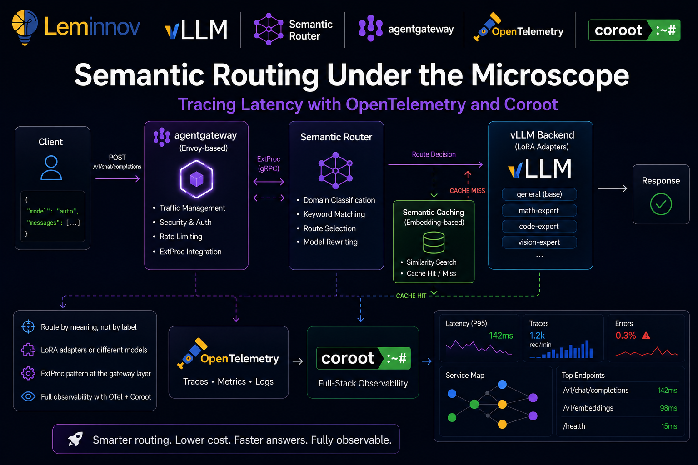
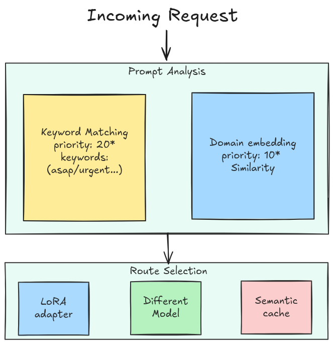
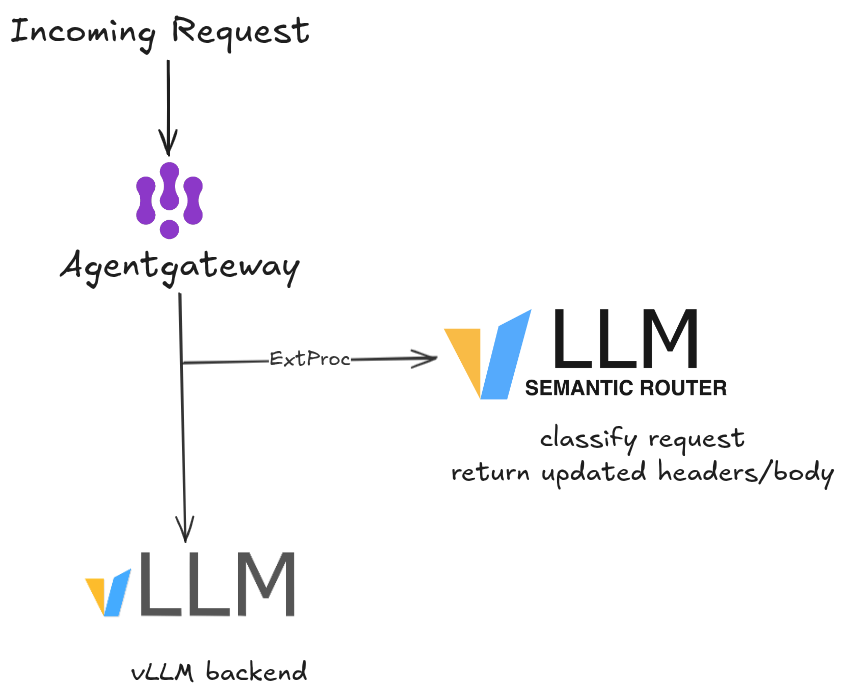
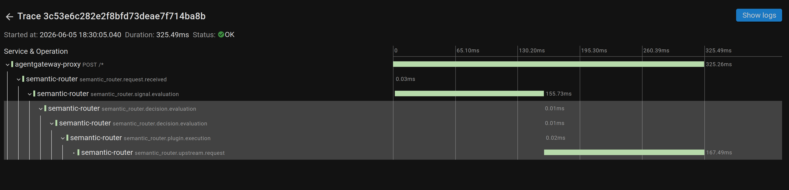
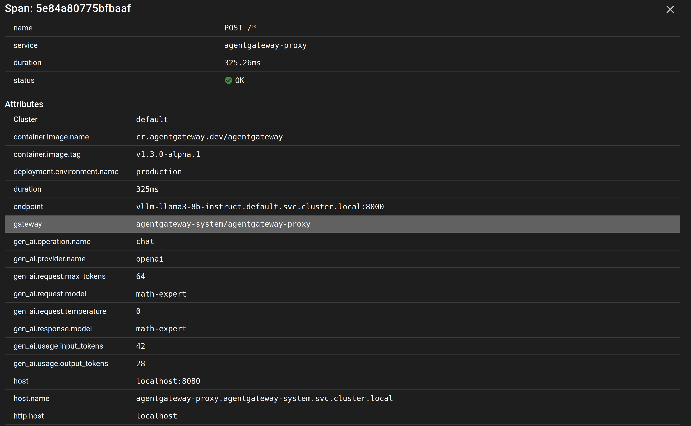

# Semantic Routing Under the Microscope: Tracing Latency 

When you send a prompt to an AI system, the first question is never "what is the answer?" — it is "which model should even handle this?" That decision, made in milliseconds before any token is generated, is **semantic routing**. Get it wrong and you are sending a simple FAQ question to your most expensive frontier model, or routing a complex mathematical proof to a tiny 3B-parameter model that will hallucinate every step.

In this post we will do two things. First, understand how semantic routing works conceptually. Second, build it on Kubernetes using the **vLLM Semantic Router** with **agentgateway**, then add a full observability layer using **OpenTelemetry** and **Coroot** so we can see — with real traces — exactly how long each routing decision takes and where latency hides.



---

## Part 1 — Concepts: How Semantic Routing Works

### The Problem With Dumb Routing

Traditional API gateways route on structure: URL path, HTTP headers, model name in the request body. When a client sends `"model": "gpt-4"`, the gateway forwards to GPT-4. Simple.

But that only works when the caller already knows which model is best. In a multi-model architecture — where you have a general model, a math-specialized LoRA adapter, a code model, a vision model, and a private on-premises model for sensitive data — the caller should not need to know. The infrastructure should figure it out from the **meaning** of the request.

That is the promise of semantic routing: route by intent, not by label.

### The Signal Extraction Layer

The vLLM Semantic Router classifies every incoming request before forwarding it. Two core signal types drive this classification:

**Domain classification** — compares the incoming prompt against predefined domain descriptions using embedding similarity. The closest match determines the route. No training needed — the description text itself acts as the classifier anchor.

**Keyword matching** — a rule-based signal for explicit triggers like forcing reasoning mode (`think`, `urgent`, `asap`).

Based on these signals, the router picks a destination. And here is the important part: **the destination does not have to be a different model**. It can be:

- A **LoRA adapter** loaded on top of a single base model (e.g., `math-expert`, `law-expert`)
- A **different model** entirely (e.g., a frontier model for complex tasks, a local model for private data)
- A **cached response** via the semantic cache plugin, skipping the LLM call entirely

This flexibility is what makes semantic routing practical — you can start with one base model and several LoRA adapters, and scale to a full multi-model setup without changing the routing logic.

### The Decision Engine

Once signals are extracted, the **decision engine** picks a route using one of 12 strategies. These range from simple rule matching (`if domain == "math" → math-expert`) to reinforcement learning policies that optimize for latency, cost, and quality simultaneously.

The key insight is that routing is not a single binary decision — it is a pipeline of classifiers that runs in parallel and whose outputs feed a final decision function.



*\* The priority numbers are not fixed — they are values **you assign to each decision** in the config. Here the keyword decision happens to be `20` and the domain decisions `10` (and `general` is `1`), which is why keyword wins ties. Set them however you like; a keyword decision could just as easily be `5`.*

So far we have described *what* the router decides — the signals, the priorities, and the route it lands on. But a decision is only useful if it can reach into the live request and change it. So the next question is *where* in the request path this logic actually runs, and how it rewrites the call without the client ever knowing. That is exactly the problem the **ExtProc pattern** solves.

### The ExtProc Pattern: Routing at the Gateway Layer

Rather than wrapping every LLM client with a routing SDK, the vLLM Semantic Router runs as an **Envoy External Processing (ExtProc)** server. This is the elegant part of the architecture.

Envoy ExtProc is a gRPC-based protocol that lets an external service intercept and mutate HTTP requests and responses inline — before Envoy forwards them. The semantic router sits on port 50051, receives the full request body, classifies it, rewrites the `model` field (e.g., changing `"auto"` to `"math-expert"`), and sends the mutated request back to Envoy, which then forwards it to vLLM.

The client sends `"model": "auto"`. The router intercepts, classifies, rewrites to `"model": "math-expert"`. vLLM receives the correct model name. The client never needed to know.




This design means routing logic is infrastructure-level, not application-level. Any OpenAI-compatible client works without modification.

---

## Part 2 — Setup Guide: Observability Backend First, Then the Router

We deploy the observability backend **first**. The semantic router's Helm values point at the OTEL collector endpoint, so the collector has to exist before the router starts — otherwise the router boots with nowhere to push traces. Stand up Coroot and its collector first, then bring up the routing stack already wired to it, and traces flow from the very first request.

### Prerequisites

Make sure these tools are installed:

```bash
# Kubernetes in Docker (for local cluster)
kind version

# Kubernetes CLI
kubectl version --client

# Helm package manager
helm version
```

You will also need **agentgateway v1.3.0-alpha.1 or newer** — the ExtProc field required by the semantic router was added after v1.2.1.

### Why Coroot?

Coroot is an open-source observability platform built specifically for Kubernetes. Unlike configuring Jaeger + Prometheus + Grafana separately, Coroot auto-discovers services from eBPF, ingests OTEL traces, and correlates them with infrastructure metrics in a single UI. For a Kubernetes-native AI stack, it is the fastest path from zero to full visibility — which is exactly why we install it before anything else.

### Step 1 — Deploy Coroot on Kubernetes

```bash
# Add Coroot Helm repo
helm repo add coroot https://coroot.github.io/helm-charts
helm repo update

# Install Coroot with the OTEL collector enabled
helm install -n coroot --create-namespace coroot-operator coroot/coroot-operator

helm install -n coroot coroot coroot/coroot-ce \
  --set "clickhouse.shards=2,clickhouse.replicas=2"
```

Verify all Coroot components are up:

```bash
kubectl get pods -n coroot
```

You should see pods for: `coroot`, `coroot-node-agent`, `prometheus`, and `clickhouse`.

Access the Coroot UI:

```bash
kubectl port-forward -n coroot svc/coroot 8880:8080 &
# Open http://localhost:8880
```

### Step 2 — Install the OpenTelemetry Collector

We run a dedicated OpenTelemetry Collector as the trace sink — the semantic router pushes to it, and it forwards on to Coroot. The upstream chart provisions the collector **and its Service**, so the OTLP endpoints (4317 gRPC / 4318 HTTP) are exposed automatically — no hand-written Service needed.

Create a `values.yaml`. It runs the collector as a DaemonSet, enables the OTLP receivers, and adds an exporter that forwards every trace and log on to Coroot's ingest endpoint (`coroot-coroot.coroot.svc.cluster.local:8080`):

```yaml
# values.yaml
mode: daemonset

image:
  repository: ghcr.io/open-telemetry/opentelemetry-collector-releases/opentelemetry-collector-k8s

command:
  name: otelcol-k8s

resources:
  requests:
    cpu: 100m
    memory: 256Mi
  limits:
    cpu: 500m
    memory: 512Mi

useGOMEMLIMIT: true

presets:
  kubernetesAttributes:
    enabled: true
  logsCollection:
    enabled: true

service:
  enabled: true
  type: ClusterIP

config:
  receivers:
    otlp:
      protocols:
        grpc:
          endpoint: 0.0.0.0:4317
        http:
          endpoint: 0.0.0.0:4318

  processors:
    batch: {}
    memory_limiter:
      check_interval: 5s
      limit_percentage: 80
      spike_limit_percentage: 25

  exporters:
    otlp_http/coroot:
      endpoint: "http://coroot-coroot.coroot.svc.cluster.local:8080"
      encoding: proto
      tls:
        insecure: true
      compression: none

  service:
    pipelines:
      traces:
        receivers: [otlp]
        processors: [memory_limiter, batch]
        exporters: [otlp_http/coroot]
      logs:
        receivers: [otlp, filelog]
        processors: [memory_limiter, batch]
        exporters: [otlp_http/coroot]
```

Install it:

```bash
helm repo add open-telemetry https://open-telemetry.github.io/opentelemetry-helm-charts
helm repo update

helm install otel-collector open-telemetry/opentelemetry-collector \
  --values values.yaml
```

The chart names the Service `<release>-opentelemetry-collector`, so with the release name `otel-collector` you get `otel-collector-opentelemetry-collector`, exposing OTLP on ports 4317 (gRPC) and 4318 (HTTP). That is the endpoint every component downstream targets: `otel-collector-opentelemetry-collector.default.svc.cluster.local:4317`.

Verify the collector and its Service are up:

```bash
kubectl get pods,svc -l app.kubernetes.io/name=opentelemetry-collector
```

With the collector live — and already forwarding to Coroot — the rest of the demo can be wired to it as we go.

### Step 3 — Install agentgateway

agentgateway is the Kubernetes Gateway API data plane that will receive client traffic and delegate to the semantic router via ExtProc.

```bash
# Install Gateway API CRDs
kubectl apply -f https://github.com/kubernetes-sigs/gateway-api/releases/download/v1.5.0/standard-install.yaml
```
Install agentgateway crds by using Helm
```bash
# Install agentgateway crds via Helm

export AGENTGATEWAY_VERSION=v1.3.0-alpha.1

kubectl apply --server-side --force-conflicts \
  -f https://github.com/kubernetes-sigs/gateway-api/releases/download/v1.5.0/standard-install.yaml

helm upgrade -i agentgateway-crds oci://cr.agentgateway.dev/charts/agentgateway-crds \
  --create-namespace \
  --namespace agentgateway-system \
  --version "${AGENTGATEWAY_VERSION}" \
  --set controller.image.pullPolicy=Always

helm upgrade -i agentgateway oci://cr.agentgateway.dev/charts/agentgateway \
  --namespace agentgateway-system \
  --version "${AGENTGATEWAY_VERSION}" \
  --set controller.image.pullPolicy=Always \
  --set controller.extraEnv.KGW_ENABLE_GATEWAY_API_EXPERIMENTAL_FEATURES=true \
  --wait
```
Verify the controller is running:

```bash
kubectl get pods -n agentgateway-system
```

### Step 4 — Create the Gateway Resource

```bash
kubectl apply -f - <<'EOF'
apiVersion: gateway.networking.k8s.io/v1
kind: Gateway
metadata:
  name: agentgateway-proxy
  namespace: agentgateway-system
spec:
  gatewayClassName: agentgateway
  listeners:
  - protocol: HTTP
    port: 80
    name: http
    allowedRoutes:
      namespaces:
        from: All
EOF
```

### Step 5 — Deploy the vLLM Backend Simulator

For local testing, the guide uses a lightweight OpenAI-compatible simulator that mimics a vLLM backend serving a base model plus LoRA adapters.

```bash
kubectl apply -f - <<'EOF'
apiVersion: apps/v1
kind: Deployment
metadata:
  name: vllm-llama3-8b-instruct
  namespace: default
spec:
  replicas: 1
  selector:
    matchLabels:
      app: vllm-llama3-8b-instruct
  template:
    metadata:
      labels:
        app: vllm-llama3-8b-instruct
    spec:
      containers:
      - name: vllm-sim
        image: ghcr.io/llm-d/llm-d-inference-sim:v0.5.0
        imagePullPolicy: IfNotPresent
        args:
        - --model
        - base-model
        - --port
        - "8000"
        - --max-loras
        - "6"
        - --lora-modules
        - '{"name": "math-expert"}'
        - '{"name": "science-expert"}'
        - '{"name": "social-expert"}'
        - '{"name": "humanities-expert"}'
        - '{"name": "law-expert"}'
        - '{"name": "general-expert"}'
        ports:
        - containerPort: 8000
          name: http
          protocol: TCP
        readinessProbe:
          httpGet:
            path: /health
            port: http
          periodSeconds: 5
          timeoutSeconds: 5
          failureThreshold: 3
---
apiVersion: v1
kind: Service
metadata:
  name: vllm-llama3-8b-instruct
  namespace: default
  labels:
    app: vllm-llama3-8b-instruct
spec:
  type: ClusterIP
  ports:
  - port: 8000
    targetPort: 8000
    protocol: TCP
  selector:
    app: vllm-llama3-8b-instruct
EOF

kubectl wait --for=condition=Available deployment/vllm-llama3-8b-instruct \
  -n default \
  --timeout=300s
```

### Step 6 — Install the vLLM Semantic Router

Create a `values.yaml` file with the routing config and observability enabled from the start. The routing decisions define 14 domains — each maps to a LoRA adapter and optionally enables reasoning mode or semantic caching ([full routing config here](https://vllm-semantic-router.com/docs/installation/k8s/agentgateway/)).

The key part is the observability block — tracing is built into the router and just needs to know where your OTEL collector is. Because we deployed that collector in Step 2, we can point straight at it (`otel-collector-opentelemetry-collector.default.svc.cluster.local:4317`) and traces start flowing the moment the router boots:

```yaml
# values.yaml
config:
  version: v0.3

  providers:
    models:
      - name: base-model
        reasoning_family: qwen3
        backend_refs:
          - name: local-vllm
            endpoint: vllm-llama3-8b-instruct.default.svc.cluster.local:8000
            weight: 1

  routing:
    decisions:
      # 14 routing decisions (math, law, physics, biology, history...)
      # each maps to a LoRA adapter with optional reasoning + system prompt
      # full config → https://vllm-semantic-router.com/docs/installation/k8s/agentgateway/

  global:
    router:
      strategy: priority
    services:
      observability:
        tracing:
          enabled: true
          provider: opentelemetry
          exporter:
            type: otlp
            endpoint: otel-collector-opentelemetry-collector.default.svc.cluster.local:4317
            insecure: true
          sampling:
            type: always_on
            rate: 1.0
          resource:
            service_name: semantic-router
            service_version: v0.1.0
            deployment_environment: production
    stores:
      semantic_cache:
        enabled: true
        backend_type: memory
        similarity_threshold: 0.8
        embedding_model: mmbert
```

Then install:

```bash
helm install semantic-router oci://ghcr.io/vllm-project/semantic-router/charts/semantic-router \
  --namespace agentgateway-system \
  --create-namespace \
  --values values.yaml
```

Verify the semantic router pod is running:

```bash
kubectl get pods -n agentgateway-system -l app=semantic-router
```

### Step 7 — Wire Routing: HTTPRoute + AgentgatewayPolicy

The **HTTPRoute** connects the gateway to the vLLM backend. Note that no `model` field is set here — the semantic router will inject it.

```bash
kubectl apply -f - <<'EOF'
apiVersion: agentgateway.dev/v1alpha1
kind: AgentgatewayBackend
metadata:
  name: semantic-router-vllm
  namespace: agentgateway-system
spec:
  ai:
    provider:
      openai: {}
      host: vllm-llama3-8b-instruct.default.svc.cluster.local
      port: 8000
---
apiVersion: gateway.networking.k8s.io/v1
kind: HTTPRoute
metadata:
  name: semantic-router-vllm
  namespace: agentgateway-system
spec:
  parentRefs:
  - name: agentgateway-proxy
    namespace: agentgateway-system
  rules:
  - backendRefs:
    - name: semantic-router-vllm
      namespace: agentgateway-system
      group: agentgateway.dev
      kind: AgentgatewayBackend
EOF
```

The **AgentgatewayPolicy** attaches the semantic router as an ExtProc filter:

```bash
kubectl apply -f - <<'EOF'
apiVersion: agentgateway.dev/v1alpha1
kind: AgentgatewayPolicy
metadata:
  name: semantic-router-extproc
  namespace: agentgateway-system
spec:
  targetRefs:
  - group: gateway.networking.k8s.io
    kind: Gateway
    name: agentgateway-proxy
  traffic:
    extProc:
      backendRef:
        name: semantic-router
        namespace: agentgateway-system
        port: 50051
      processingOptions:
        requestHeaderMode: Send
        requestBodyMode: Buffered
        responseHeaderMode: Send
        responseBodyMode: Buffered
        allowModeOverride: true
EOF
```

### Step 8 — Enable Gateway-Level Tracing

So far only the semantic router emits traces. But the router sees the request *after* the gateway has received it — so we are missing the very first hop. agentgateway can emit its own frontend span for every request and push it to the same collector, giving us a continuous trace: **gateway span → ExtProc → router spans**.

We do this with a second `AgentgatewayPolicy` of type `tracing`, attached to the same gateway. Note the `attributes` block — it lets you enrich each span with request metadata (here: a custom `x-header-tag` header and the request host), which is invaluable for filtering traces by tenant, route, or client.

```bash
kubectl apply -f - <<'EOF'
apiVersion: agentgateway.dev/v1alpha1
kind: AgentgatewayPolicy
metadata:
  name: tracing
  namespace: agentgateway-system
spec:
  targetRefs:
    - kind: Gateway
      name: agentgateway-proxy
      group: gateway.networking.k8s.io
  frontend:
    tracing:
      backendRef:
        name: otel-collector-opentelemetry-collector
        namespace: default
        port: 4317
      protocol: GRPC
      clientSampling: "true"
      randomSampling: "true"
      resources:
        - name: deployment.environment.name
          expression: '"production"'
        - name: service.version
          expression: '"test"'
      attributes:
        add:
          - expression: 'request.headers["x-header-tag"]'
            name: request
          - expression: 'request.host'
            name: host
EOF
```

With this in place, the gateway and the router both report into the same collector — so the trace you open in Coroot now spans the entire request path, not just the routing decision.

### Step 9 — Test the Routing

Port-forward the gateway and send a test request with `model: "auto"`:

```bash
kubectl port-forward -n agentgateway-system svc/agentgateway-proxy 8080:80 &

# Math prompt — should route to math-expert
curl -s http://localhost:8080/v1/chat/completions \
  -H "Content-Type: application/json" \
  -d '{
    "model": "auto",
    "messages": [{"role": "user", "content": "What is the derivative of x squared?"}]
  }' | jq '.model'

# Science prompt — should route to science-expert
curl -s http://localhost:8080/v1/chat/completions \
  -H "Content-Type: application/json" \
  -d '{
    "model": "auto",
    "messages": [{"role": "user", "content": "How does mitosis work?"}]
  }' | jq '.model'
```

You should see `"math-expert"` and `"science-expert"` in the responses respectively — the semantic router correctly classified and mutated each request.

---

## Part 3 — Observability: Reading the Traces

The routing is working — and because we stood up the OTEL collector and Coroot **first**, every request we just sent already emitted traces. The router was instrumented at install time (Step 6): its tracing block points straight at the collector, which forwards to Coroot. No retrofitting, no second `helm upgrade`. We are no longer flying blind, and we can finally answer:

- How long does signal extraction take?
- How long does the embedding step add versus rule-based classification?
- Is routing latency stable or does it spike under load?
- Which part of the pipeline is the bottleneck?

So all that is left is to generate some load and read the results in Coroot.

### Step 10 — Generate Load and Inspect Traces

Send a batch of requests to generate trace data:

```bash
for prompt in \
  "solve the equation 2x + 5 = 15" \
  "what is the speed of light" \
  "write a Python function to reverse a string" \
  "explain the theory of relativity" \
  "what is the capital of Japan" \
  "integrate cos(x) from 0 to pi"; do
  curl -s http://localhost:8080/v1/chat/completions \
    -H "Content-Type: application/json" \
    -d "{\"model\": \"auto\", \"messages\": [{\"role\": \"user\", \"content\": \"$prompt\"}]}" &
done
wait
```

Now open Coroot at `http://localhost:8880` and navigate to **Services → semantic-router → Tracing**.

### What the Traces Reveal

Each trace for a routing decision will show a hierarchy of spans. Because we enabled gateway-level tracing in Step 8, the trace now starts at the **agentgateway frontend span** and continues down into the router — one continuous timeline from the moment the request hits the gateway to the mutated response:



Drilling into a single span breaks the routing decision down into its parts, so you can see exactly where the milliseconds go:



---

## Conclusion

Semantic routing is the invisible layer that makes multi-model AI architectures practical. Instead of forcing every client to know which model is best for every query, the router classifies intent at the infrastructure level using a pipeline of ML encoders — sequence classifiers, embedding similarity, PII detectors — and mutates the request before it ever reaches the model.

The vLLM Semantic Router with agentgateway puts this at the Kubernetes Gateway layer using Envoy ExtProc, which means it works with any OpenAI-compatible client out of the box.

But routing logic without observability is a black box. Adding OpenTelemetry and Coroot closes that gap: every routing decision becomes a trace, every span reveals where milliseconds are spent, and the service map gives you end-to-end visibility from client to model.

The next time someone asks "why is my AI response slow?", you will have an answer — and it might surprise you: the model was not the bottleneck. The routing decision was.

---

*Stack used in this post: vLLM Semantic Router, agentgateway, Kubernetes (kind), OpenTelemetry, Coroot*
